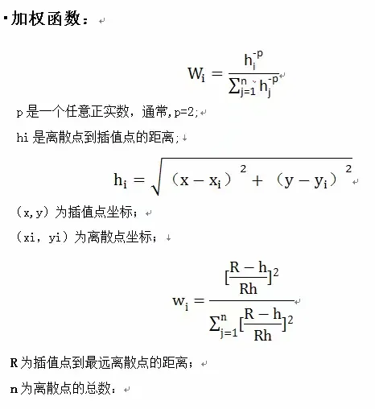
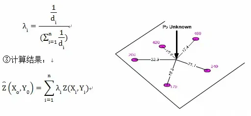
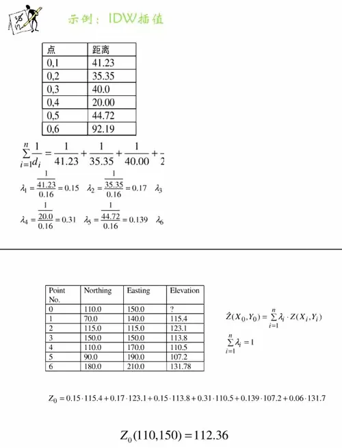
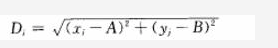
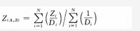

>:原文链接：https://www.jianshu.com/p/b38c5e464d16

&emsp;&emsp;反距离加权法（Inverse Distance Weighted）插值是近期做大数据显示时使用的插值方法，很好用的插值方法。

&emsp;&emsp;反距离权重法主要依赖于反距离的幂值，幂参数可基于距输出点的距离来控制已知点对内插值的影响。幂参数是一个正实数，默认值为2。（一般0.5到3的值可获得最合理的结果）。

&emsp;&emsp;通过定义更高的幂值，可进一步强调最近点。因此，邻近数据将受到更大影响，表面会变得更加详细（更不平滑）。随着幂数的增大，内插值将逐渐接近最近采样点的值。指定较小的幂值将对距离较远的周围点产生更大的影响，从而导致平面更加平滑。

&emsp;&emsp;由于反距离权重公式与任何实际的物理过程都不关联，因此无法确定特定幂值是否过大。作为常规准则，认为值为30的幂是超大幂，因此不建议使用。此外还要牢记一点，如果距离或幂值较大，则可能生成错误结果。

&emsp;&emsp;在IDW插值之前,我们可以事先获取一个离散点子集，用于计算插值的权重；  
&emsp;&emsp;原因1：离散点距离插值点越远，其对插值点的影响力越低，甚至完全没有影响力；  
&emsp;&emsp;原因2：离散点越少可以加快运算速度；

## IDW步骤
IDW插值方法假定每个输入点都有着局部影响，这种影响随着距离的增加而减弱。
步骤：
①计算未知点到所有点的距离；
② 计算每个点的权重：权重是距离的倒数的函数。

---

>原文链接： https://blog.csdn.net/welcome_yu/article/details/114852788  

DW（反距离里加权插值）  (python)  

&emsp;&emsp;假设 距离较近的事物要比距离较远的事物更相似。  
&emsp;&emsp;当为任何未测量的位置预测值时，反距离权重法会采用预测位置周围的测量值与距离预测位置较远的测量值相比，距离预测位置最近的测量值对预测值的影响更大。反距离权重法假定每个测量点都有一种局部影响，而这种影响会随着距离的增大而减小。由于这种方法为距离预测位置最近的点分配的权重较大，而权重却作为距离的函数而减小，因此称之为反距离权重法。  

原理：  

&emsp;&emsp;1.计算所有离散数据点与所求网格点的距离，在二维平面空间，离散点（xi,yi）到网格（A,B）的距离Di为：  

&emsp;&emsp;2.找出离网格点（A,B）最近的N个离散点的距离，则网格点（A,B）上的估算值为：  

  

&emsp;&emsp;其中，Zi为离散点i上的观测值，Z(A,B)为网格点（A,B）上的估算值。
